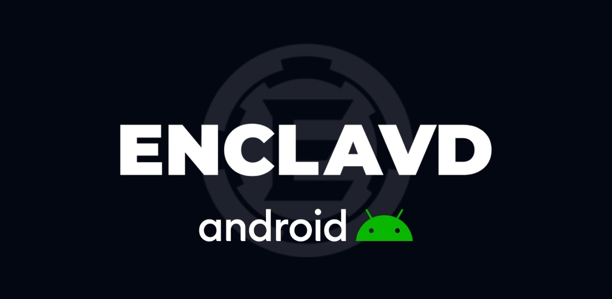
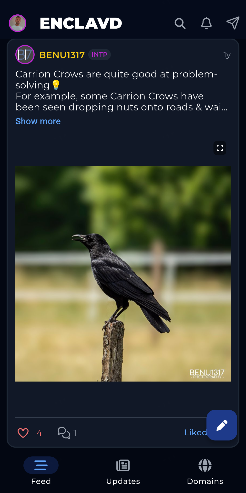
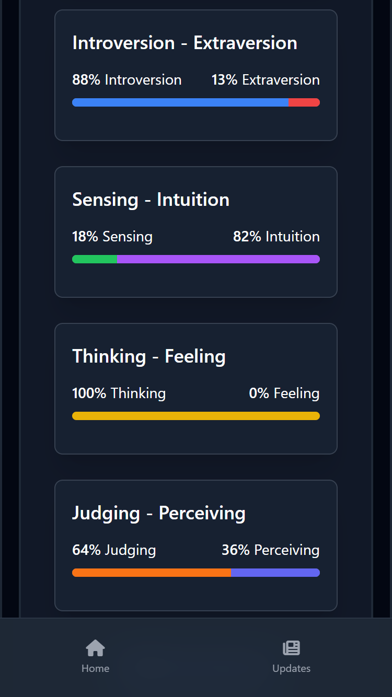
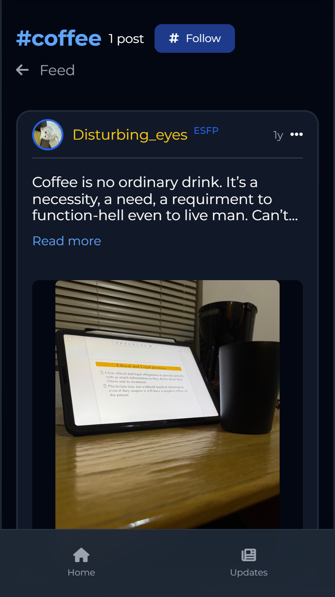
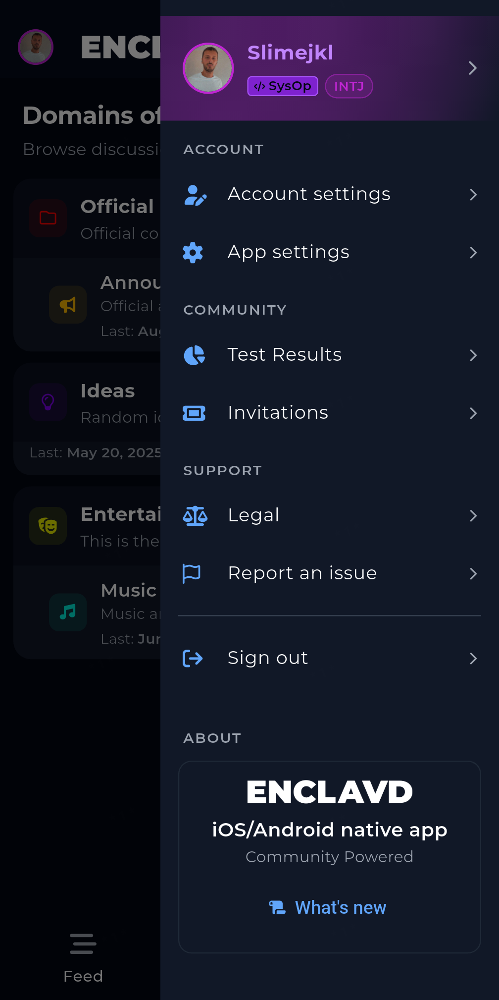
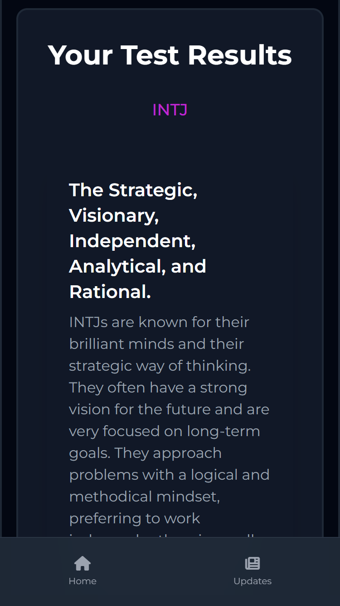
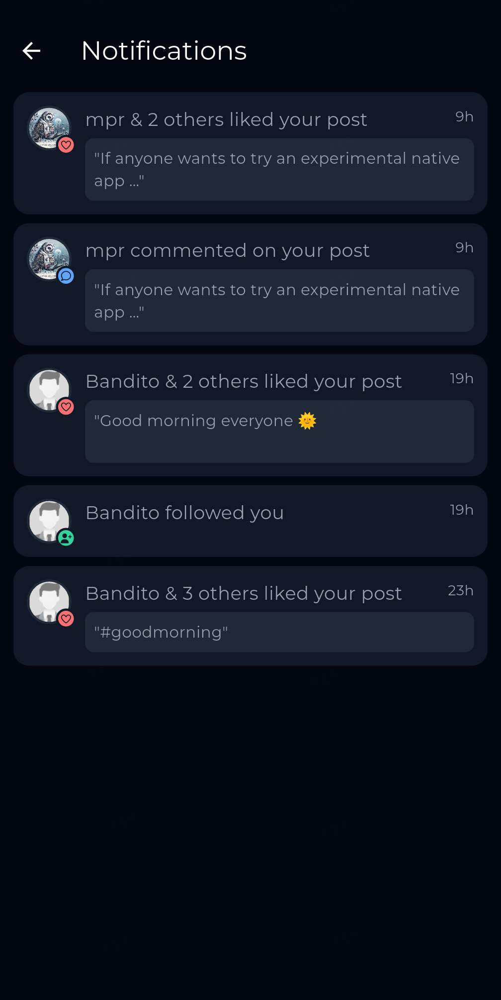
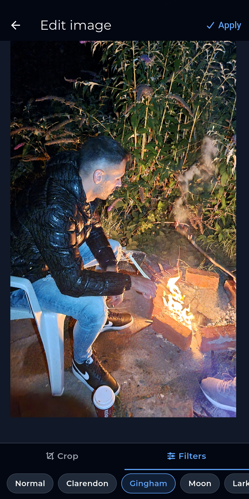

# Enclavd - Personality Social Network


Stop broadcasting into the void. Enclavd is a rivate social network built on compatibility. Take a personality quiz, get matched with people on your wavelength, and connect through a feed built around who you actually are.

<b>CORE PRINCIPLES</b>

<b>Personality Types:</b> Your feed is filtered by personality. Find people who are on the same frequency.

<b>Quality Content:</b> We maintain high quality standards for content, removing spam and curating the feed.

<b>Clean Interface:</b> A clean, stripped-back design built for focus, with nothing competing for your attention.

<b>WHO ENCLAVD IS FOR</b>
- You're tired of social media feeds.
- You're looking for real conversations.
- You'd rather join through a trusted network than scroll past bots.


Take the quiz. Find your matches. Build your enclave.
Download Enclavd and stop existing for the feed.

## Screenshots

<p>
  
  
  
</p>
<p>
  
  
  
</p>
<p>
  
</p>

## Build-time configuration (flavors)

Every flavor-level switch is a compile-time dart-define read by
`lib/config/app_config.dart`. The GitHub workflow applies them per flavor.

| Flavor  | API base            | Notifications | Insecure TLS |
|---------|---------------------|---------------|--------------|
| `play`  | https://enclavd.com  | on            | no           |
| `fdroid`| https://enclavd.com  | off           | no           |
| `dev`   | https://enclavd.com  | on            | no           |

## Building

```sh
flutter pub get
flutter analyze --fatal-infos
flutter test
flutter build apk --debug --dart-define=ENCLAVD_FLAVOR=dev
```

CI (`.github/workflows/build.yml`) runs all builds.

## Layout

```
📂 lib/
  📄 main.dart                 App entry + service container
  📄 config/app_config.dart    Build-time flavor/feature switches
  📁 api/                      api_client - auth_service - feed_service
  📁 screens/                  Splash - login - register - feed
  📁 theme/                    Design system
  📁 widgets/                  Post Card (Feed)
📁 test/                       Unit Tests (pure Dart, headless)
📁 assets/                     Fonts, default avatar, logo
```
